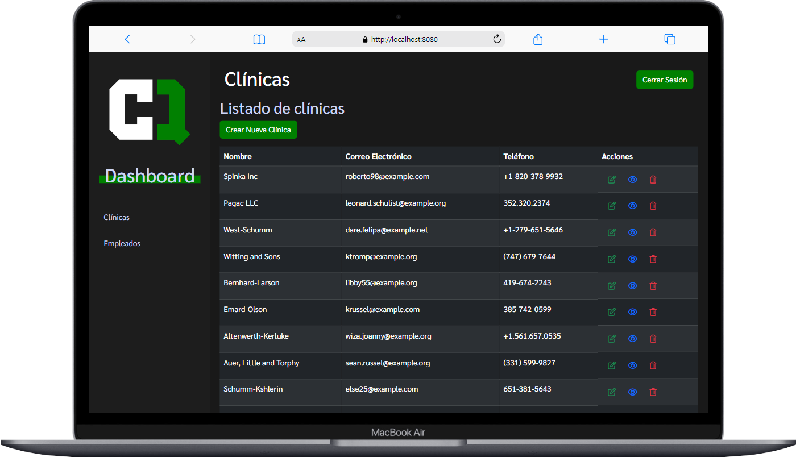

# Sistema de Administración de Clínicas

Este proyecto es un sistema de administración para clínicas que incluye un backend desarrollado en Laravel y un frontend en Vue.js.


## Diseño


## Estructura del Proyecto

- `backend/`: Contiene el código del backend desarrollado en Laravel.
- `frontend/`: Contiene el código del frontend desarrollado en Vue.js.

## Configuración

```bash

### Clonar el Repositorio
git clone https://github.com/tu-usuario/adm-clinica.git


### Instalación del Backend (Laravel)
cd adm-clinica/backend
composer install

### Configurar el archivo .env (Laravel)
cp .env.example .env

DB_CONNECTION=mysql
DB_HOST=127.0.0.1
DB_PORT=3306
DB_DATABASE=veterinariaejemplo
DB_USERNAME=root
DB_PASSWORD=

CREATE DATABASE veterinariaejemplo;


### Ejecutar las Migraciones
php artisan migrate

### Ejecutar los Seeders
php artisan db:seed


## Instalación del Frontend (Vue.js)
cd adm-clinica/frontend
npm install


## Ejecución del Proyecto
Para ejecutar el backend (Laravel), desde la carpeta backend/:
php artisan serve


Para ejecutar el frontend (Vue.js), desde la carpeta frontend/:
npm run serve


